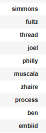

# Classifying Subreddits

In this notebook, I aim to answer the question: What characteristics of a post on Reddit contribute most to what subreddit it belongs to?
Specifically, when comparing two subreddits, what words in title let you know which subreddit is from?

The two subreddits I chose to compare were the NBA (National Basketball Association) and the 76ers ( a team in the NBA). I did this since it seemed like a good edge-case to test. Both subreddits have similar subject matter which might lead to a reduced accuracy score but it would be interesting to see how well the models perform.

In order to even start answering this question, we must first gather the data we wish to use from each subreddit. In order to do this we use the requests and json library in python to extract data from the json reddits pages. In this part of the project I had to explore the json files in order to find where my desired information was located. Once I determined that, I made requests from reddit for posts and got around 800 posts for each subreddit. From there I explored the data more and decided it was best for me to use the title as the basis for my classification as there was not much selftext.

From there I used a Count Vectorizer and TFIDF Vectorizer to transform the titles into easily digestable features for my models. For my targets , I made the 76ers a 1 and the NBA a 0. The models I decided to go with were the Logistic Regression, Random Forest Classifier, and the Multinomial Naive Bayes models.

After doing Logistic Regression, I looked at words that came up the most frequently and it turned out to be mostly names of famous NBA players. For the NBA coefficients players that were famous industry-wide were listed and for the 76ers coefficients , star players of the team were mentioned a lot. Words like Curry, Lebron, and Kobe were words that made the classifier think a post belonged to the NBA subreddit. Words like Embiid, Joel, and Ben identified a post as being a part of 76ers subreddit. This is shown below.

Top ten 76ers key words
</img>

Top ten NBA key words
</img>

Overall, all the models I tested performed similarly, overfitting on training data (99% accuracy) and getting lower scores for test (around 80% accuracy). Mulitnomial Naive Bayes performed the best, but it wasn't much better.